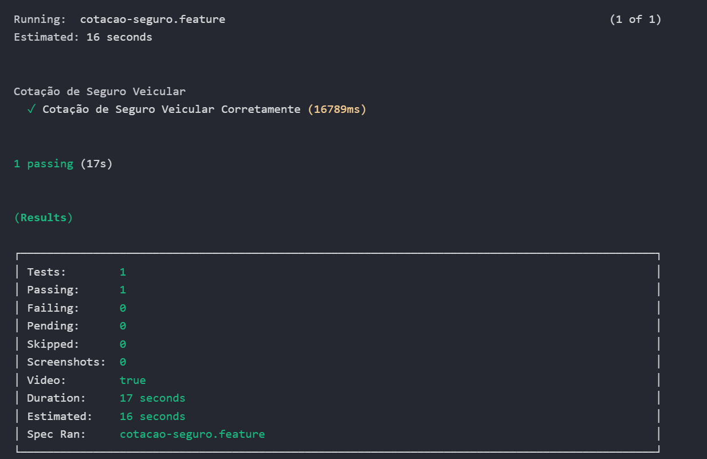
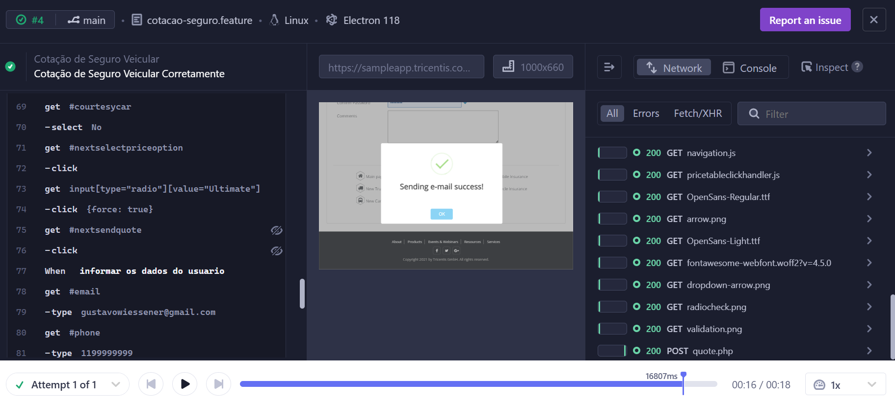

# Projeto de Testes Automatizados - Cotação de Seguro Veicular

O projeto consistente em testes automatizados para a funcionalidade de Cotação de Seguro Veicular, este projeto utiliza Cypress e Cucumber para garantir a qualidade e o funcionamento correto do processo de cotação de seguros de veículos. Através de um fluxo completo de testes end-to-end (e2e), cobrimos todas as etapas críticas para a realização bem-sucedida de uma cotação.

## 🔍 Descrição do Projeto

Este projeto simula o fluxo de uma cotação de seguro veicular no qual o usuário:
1. Acessa a página de cotação.
2. Informa todos os dados do veículo, do seguro, segurado e do produto.
3. Finaliza a cotação com dados de usuário.

O objetivo é garantir que, ao inserir corretamente todas as informações, a cotação seja concluída com sucesso.

## 🚀 Tecnologias Utilizadas

- **[Cypress](https://www.cypress.io/)**: Framework para automação de testes end-to-end.
- **[Cucumber](https://cucumber.io/)**: Integração com Cypress para escrever cenários em linguagem natural (Gherkin).
- **GitHub Actions**: CI/CD para execução automática de testes.

## 📂 Estrutura do Projeto

O código dos testes está organizado conforme abaixo:

- `cypress/e2e/step-definitions`: Diretório contendo os cenários de teste em formato `.feature`. para seguir o padrão do cucumber.
- `cypress/fixtures/`: Arquivos JSON com dados de entrada para os testes, como dados de veículo, segurado e produto, utilizando os propios padrões do Cypress para gestão de dados.
- `cypress/support/`: Funções auxiliares que permitem preencher e navegar no fluxo da aplicação de cotação, utilizando as própios funções de Custom Commands.

## 🔧 Configuração e Instalação

1. **Clone o repositório**:
    ```bash
    git clone https://github.com/seu_usuario/cypress-cucumber-cotacoes.git
    cd repositorio
    ```

2. **Instale as dependências**:
    ```bash
    npm install
    ```

3. **Configuração do Cypress**:
   Crie uma conta no Cypress Dashboard e configure a chave `CYPRESS_RECORD_KEY` como segredo no GitHub, necessária para a execução em CI.

4. **Execução dos testes**:
    - Para rodar os testes localmente:
      ```bash
      npm run cypress:open
      ```
    - Para execução em modo headless:S
      ```bash
      npm run cypress:run
      ```

## 📈 CI/CD com GitHub Actions

Este projeto inclui um pipeline de CI/CD com GitHub Actions para rodar os testes automaticamente em cada push na branch `main`.

```yaml
name: Cypress e2e Tests
on:
  push:
    branches:
      - main 
jobs:
  cypress-run:
    runs-on: ubuntu-latest
    strategy:
      fail-fast: false 
      matrix:
        containers: [1, 2] 
    steps:
      - name: Checkout
        uses: actions/checkout@v4

      - name: Set up Node.js
        uses: actions/setup-node@v3
        with:
          node-version: '16' 

      - name: Install Dependencies
        run: npm install

      - name: Cypress run
        run: npm run cypress:run
        env:
          CYPRESS_RECORD_KEY: ${{ secrets.CYPRESS_RECORD_KEY }}
          GITHUB_TOKEN: ${{ secrets.GITHUB_TOKEN }}
```
## 📈 Métricas e Integrações:
Este projeto inclui integrações com Cypress Dashboard Cloud para métricas após cada disparo em ambientes de CI.



<br>

